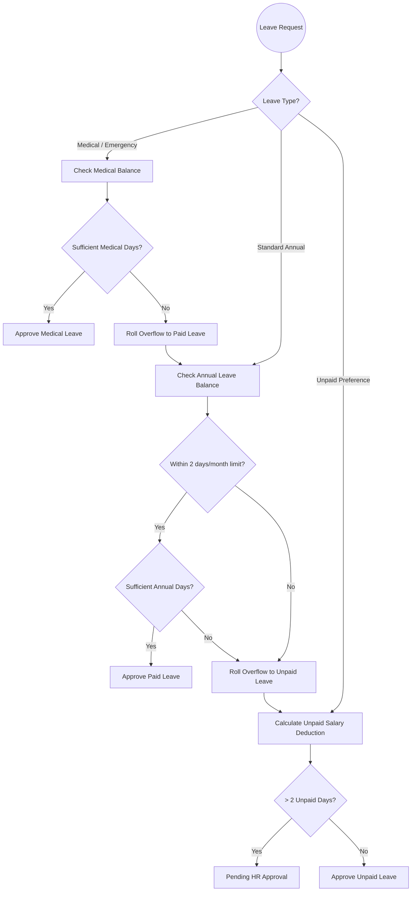

# Smart Leave Agent - Core Use Cases

This document outlines the primary use cases and capabilities of the Smart Leave Agent system. The system is designed to automate HR leave processing securely, efficiently, and with built-in policy enforcement.

---

## 1. Booking a Standard Paid Leave
**Description**: An employee requests time off using their Annual Leave balance.
**Agent Workflow**:
- The user provides their Employee ID, Start Date, End Date, and Reason.
- The `intent_router` gathers the missing slots through conversation.
- The `employee_agent` verifies the employee exists and checks their Annual Leave balance.
- The `holiday_agent` checks for weekends and Indian public holidays during the requested period.
- The `calculation_agent` evaluates the working days against the policy limitation of max 2 paid leaves per month, and verifies they have sufficient `leave_balance`.
- **Cascading Fallback**: If the working days exceed the available `leave_balance` or the monthly policy limit, the remaining days automatically roll over into Unpaid Leave.
- The `submission_agent` saves the final application to the database.

## 2. Booking a Medical Leave (or Emergency)
**Description**: An employee requests time off due to sickness or medical emergencies.
**Agent Workflow**:
- Operates similarly to a Paid Leave, but the system explicitly targets the **Medical Leave** balance (max 10 days).
- **Cascading Fallback Flow**: The system cascades deductions in the following order: `Medical Leave Balance` ➔ `Paid Leave Balance` ➔ `Unpaid Leave`. 
- This ensures that if the Medical Leave balance is exhausted, the system first rolls the remaining days over to the employee's regular Paid Leave balance, and only resorts to Unpaid Leave if both balances are exhausted.

## 3. Booking an Unpaid Leave (Loss of Pay)
**Description**: An employee requests time off but does not want to use (or has exhausted) their paid leave balance.
**Agent Workflow**:
- The `calculation_agent` calculates the exact salary deduction based on the employee's annual salary and the number of unpaid working days requested. All requested days bypass medical and paid balances.
- **HR Escalation Rule**: If the employee requests more than 2 unpaid days in a single request, the `calculation_agent` automatically flags the application status as **"Pending HR Approval"** rather than auto-approving it.

### Core Leave Deduction Architecture

## 4. Automatic Holiday & Weekend Detection
**Description**: Ensuring employees are not penalized for taking leave over holidays or weekends.
**Agent Workflow**:
- The system automatically ignores Saturdays and Sundays.
- The system queries the Indian public holiday calendar (e.g., Independence Day, Diwali, Holi). If a public holiday falls within the leave window, it is not counted against the employee's leave balance or salary deduction.

## 5. Preventing Overlapping Leaves (Conflict Resolution)
**Description**: Preventing an employee from double-booking time off.
**Agent Workflow**:
- The `employee_agent` cross-references the requested start and end dates with the employee's existing leave history in the SQLite database.
- If an overlap is detected (e.g., booking Aug 10-15 when Aug 12-14 is already booked), the `intent_router` halts the pipeline, alerts the user, and asks them to provide non-conflicting dates.

## 6. Leave Cancellation / Revocation
**Description**: An employee wants to cancel a leave they previously booked.
**Agent Workflow**:
- The user provides their Employee ID and asks to cancel a specific leave (e.g., "Cancel my leave in August").
- The system matches the dates to an existing leave application and deletes the record from the database, effectively restoring their leave balance.

## 7. Leave Balance Inquiry
**Description**: An employee simply wants to know how much time off they have left.
**Agent Workflow**:
- The user asks for their leave balance and provides their Employee ID.
- The `employee_agent` fetches their profile and outputs a formatted Markdown summary of their Annual and Medical leave balances without actually initiating a leave application.
