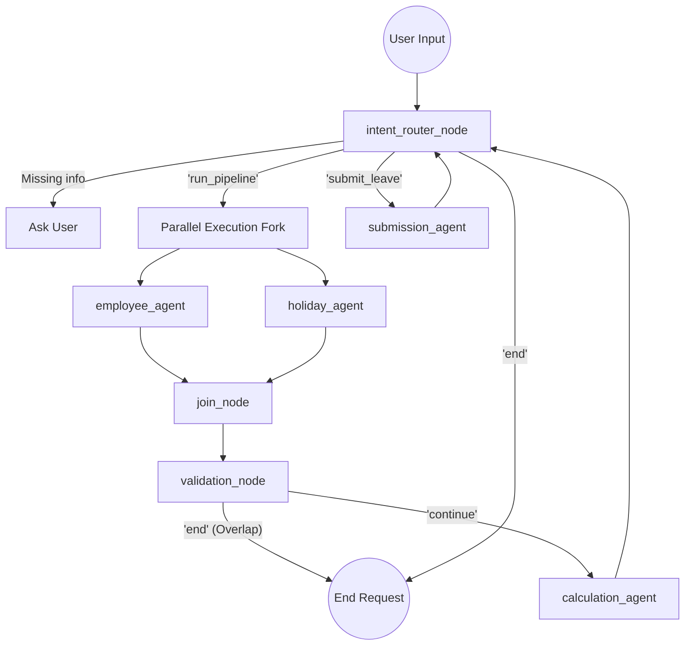

# Smart Leave Agent - Comprehensive Technical Documentation

This document provides a deep dive into the architecture, workflow, directory structure, agent implementations, and deployment commands for the **Smart Leave Agent** system.

---

## 1. System Architecture and Workflow Flow

The Smart Leave Agent leverages **Google ADK 2.0** to orchestrate multiple autonomous agents working together to fulfill an HR leave request. The primary workflow utilizes a **parallel execution graph**.



### Flow Breakdown
1. **Routing (`intent_router_node`)**: Evaluates user input. Extracts entities (Employee ID, Start Date, End Date, Reason). 
2. **Parallel Fetching (`run_pipeline`)**: If all entities are gathered, it simultaneously invokes the `employee_agent` (to check the SQLite DB for employee data) and the `holiday_agent` (to check the SQLite DB for public holidays). 
3. **Validation & Calculation (`continue`)**: After joining the parallel data, it passes through the `validation_node` to ensure there are no overlapping leaves, bypassing the LLM intent router. If validated, it routes directly to `calculation_agent` to deduct weekends and holidays, calculate the final working days, and apply the cascading policy limits (Medical → Paid → Unpaid).
4. **Confirmation**: Stops and asks the user for explicit confirmation before submitting.
5. **Submission (`submit_leave`)**: Upon "Yes", invokes the `submission_agent` to write to the database.

---

## 2. Working Directory Structure

The project is structured into clear responsibilities:

```text
SmartLeave_Agent/
├── .env                  # Environment variables (GEMINI_API_KEY)
├── pyproject.toml        # Project definitions and dependencies
├── uv.lock               # Dependency lock file for `uv`
├── USE_CASES.md          # Functional documentation and cases
├── src/
│   ├── agents/           # ADK Agents (Employee, Holiday, Calculation, Submission)
│   ├── config/           # Application config (settings.py)
│   ├── database/         # SQLite init_db.py and operations.py
│   ├── nodes/            # ADK Nodes (Intent Router, Formatting Nodes, HR Node)
│   └── workflows/        # ADK Workflow Definitions (Parallel & Sequential graphs)
└── tests/                # Automated testing
```

---

## 3. Agents, Prompts, and Tools

Each agent is defined by an `agent.py`, a `prompt.py`, and a `tools.py`. The agents act as specialized workers for the main workflow graph.

### 3.1 Employee Agent
**Role**: Fetches employee details and checks for overlapping leaves.
**Prompt**:
```markdown
You are a backend HR Database Agent. 
You MUST execute BOTH of your tools (get_employee_details AND lookup_existing_leaves) immediately in the background.
CRITICAL: Do NOT converse with the user...
After executing your tools, you MUST summarize the employee's profile using EXACTLY this markdown format with bullet points:
...
```
**Tools**:
- `get_employee_details`: Queries `database.operations` to get balances, salary, etc.
- `lookup_existing_leaves`: Ensures the requested dates do not overlap with an already approved leave for this employee.

### 3.2 Holiday Agent
**Role**: Identifies public holidays falling within the leave period.
**Prompt**:
```markdown
You are a backend Holiday Database Agent.
You MUST execute your tool immediately to check for holidays.
...
After executing your tool, you MUST output the exact formatted summary of the holidays and weekends using exactly this markdown format:
- Holidays in this period: [X] 
- Weekends in this period: [X]
```
**Tools**:
- `get_holiday_details`: Queries the database for holidays falling between the requested `start_date` and `end_date`.

### 3.3 Calculation Agent
**Role**: Calculates actual working days and formats the final summary before submission.
**Prompt**:
```markdown
You are the HR Calculation Agent. 
You MUST execute your calculation tool immediately to process the math. 
...
Then, you MUST output the exact formatted summary that the tool returned. 
CRITICAL INSTRUCTION 3: You MUST include the final question ("Do you want to submit this request? (Yes/No)") at the very bottom...
```
**Tools**:
- `calculate_leave`: Executes `calculate_and_format_leave_node`. This function handles the complex math (excluding weekends), and enforces the cascading fallback logic (deducting from Medical balance, then Paid balance, then calculating Unpaid deductions). 

### 3.4 Submission Agent
**Role**: Modifies the SQLite database.
**Prompt**:
```markdown
You are the HR Submission Agent. 
You MUST execute your tools immediately to save or revoke the request in the database. 
CRITICAL: Do not converse with the user before running the tool...
Then, summarize the success or error message from the tool for the user in a friendly, conversational way.
```
**Tools**:
- `submit_leave`: Saves the leave request via `database.operations.save_leave_application`.
- `revoke_leave`: Cancels a previously approved leave request and refunds the balance.

---

## 4. Setup, Local Execution, and Commands

The system relies on `uv` for lightning-fast dependency management and execution.

### Environment Setup
Create a `.env` file at the root:
```env
GEMINI_API_KEY="your_api_key_here"
```

Initialize the environment and the SQLite database:
```bash
uv venv
uv sync
uv run python src/database/init_db.py
```

### Running Locally
To test the workflow on your local machine using the built-in ADK Web UI:
```bash
uv run adk web src/workflows/leaves_agent_parallel
```
*Access the chat interface at `http://localhost:8080`.*

---

## 5. Deployment on Agent Engine

Google ADK allows you to deploy these workflows seamlessly to Google Cloud's Agent Engine.

### Step 1: Google Cloud Auth
```bash
gcloud auth login
gcloud auth application-default login
```

### Step 2: Deploy Command
Run the ADK deployment command specifying your project ID and region:
```bash
uv run adk deploy agent_engine src/workflows/leaves_agent_parallel --project YOUR_PROJECT_ID --region us-central1
```

Once deployment is complete, the CLI will output a `session_service_uri` (e.g., `agentengine://1234567890123456789`).

### Step 3: Connect Local UI to Cloud Deployment
You can interact with your newly deployed cloud agent using the local UI (which acts as a thin client connecting to the cloud instance):
```bash
uv run adk web src/workflows/leaves_agent_parallel --session_service_uri "agentengine://1234567890123456789"
```
*Make sure to replace the URI with the specific resource ID returned during your deployment!*
